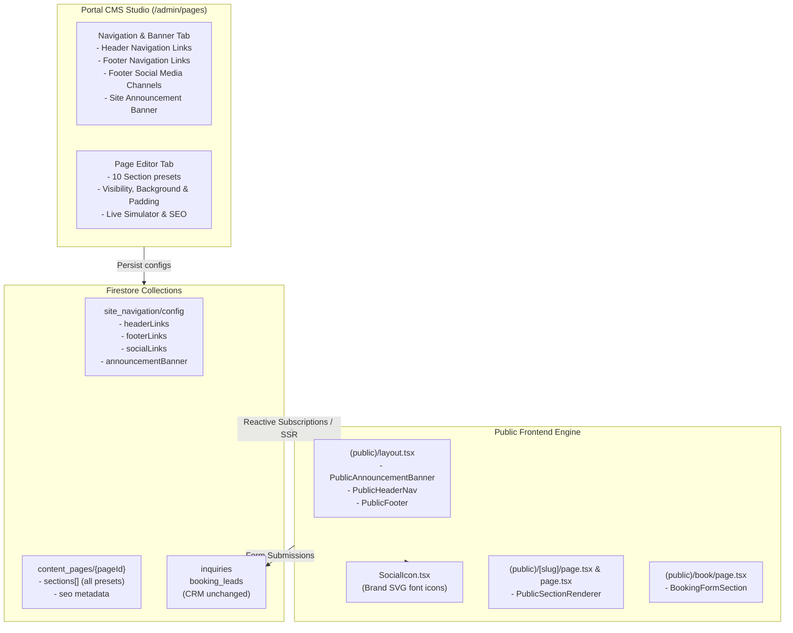

# Stage 29 Implementation Plan: Public Website Modular Section Engine, Configurable Navigation & Social Media Integration

**Stage Number:** 29  
**Branch:** `feature/stage-29`  
**Status:** In Review & Finalizing

---

## 1. Objective & Scope
Refactor the public website template to use a unified, modular section engine (`PublicSectionRenderer`), elevate the public booking request form into a first-class CMS preset component (`BookingFormSection`) without breaking portal CRM pipelines, and introduce reactive navigation management, global announcement banner controls, and configurable social media links with brand font icons into the footer navigation structure and CMS Navigation Studio.

---

## 2. User Review Required & Guardrails

> [!IMPORTANT]
> - **Zero Breaking Changes to Booking & CRM**: The booking form's underlying Firestore destinations (`inquiries`, `booking_leads`), validation schema (`BookingInputSchema`), anti-bot honeypots (`company_website_url`), rate-limits, and portal CRM views (`/admin/inquiries`, `/admin/crm`) remain 100% preserved.
> - **Configurable Navigation & Link Visibility**: The public header and footer navigation are powered by a dedicated CMS navigation manager allowing administrators to add links, reorder them, toggle visibility (hide/show without deleting), designate CTA buttons, and configure an active site-wide announcement banner.
> - **Social Media Integration**: Official band social channels (YouTube, Instagram, Facebook, TikTok, Spotify, Twitter/X) are defined in `SiteNavigationSchema` and rendered with brand font icons in the footer navigation structure.

---

## 3. Architecture & Workflow

---

## 4. Targeted Code & File Manifest

1. [`src/lib/schema/siteConfig.ts`](file:///c:/repos/eagleburgerband/src/lib/schema/siteConfig.ts) — Navigation schemas, `NavLinkSchema`, `SocialLinkSchema`, `AnnouncementBannerSchema`, and `SiteNavigationSchema`.
2. [`src/lib/schema/page.ts`](file:///c:/repos/eagleburgerband/src/lib/schema/page.ts) — Section presets schemas and `ContentSectionSchema` (`isVisible`, `background`, `padding`).
3. [`src/components/cms/PublicSectionRenderer.tsx`](file:///c:/repos/eagleburgerband/src/components/cms/PublicSectionRenderer.tsx) — Universal modular section renderer for all 10 presets.
4. [`src/components/public/BookingFormSection.tsx`](file:///c:/repos/eagleburgerband/src/components/public/BookingFormSection.tsx) — Reusable public booking inquiry form.
5. [`src/components/public/PublicHeaderNav.tsx`](file:///c:/repos/eagleburgerband/src/components/public/PublicHeaderNav.tsx) — Reactive top header navigation with mobile drawer.
6. [`src/components/public/PublicFooter.tsx`](file:///c:/repos/eagleburgerband/src/components/public/PublicFooter.tsx) — Reactive footer with social media channels and font icons.
7. [`src/components/public/PublicAnnouncementBanner.tsx`](file:///c:/repos/eagleburgerband/src/components/public/PublicAnnouncementBanner.tsx) — Reactive, dismissible site announcement banner.
8. [`src/components/ui/SocialIcon.tsx`](file:///c:/repos/eagleburgerband/src/components/ui/SocialIcon.tsx) — Brand SVG font icons (YouTube, Instagram, Facebook, TikTok, Spotify, Twitter/X).
9. [`src/app/(portal)/admin/pages/page.tsx`](file:///c:/repos/eagleburgerband/src/app/(portal)/admin/pages/page.tsx) — CMS Studio: Navigation & Banner tab, Section card controls, and preset editors.

---

## 5. Verification Plan

- **Type Checking:** `npx tsc --noEmit` (0 errors).
- **Linting:** `npm run lint` (0 errors, 0 warnings).
- **Production Build:** `npm run build` (Turbopack, all 49 routes statically rendered).
- **Functional Tests:** Verify reactive updates in footer social channels, header link visibility, and booking form inquiry submission.
