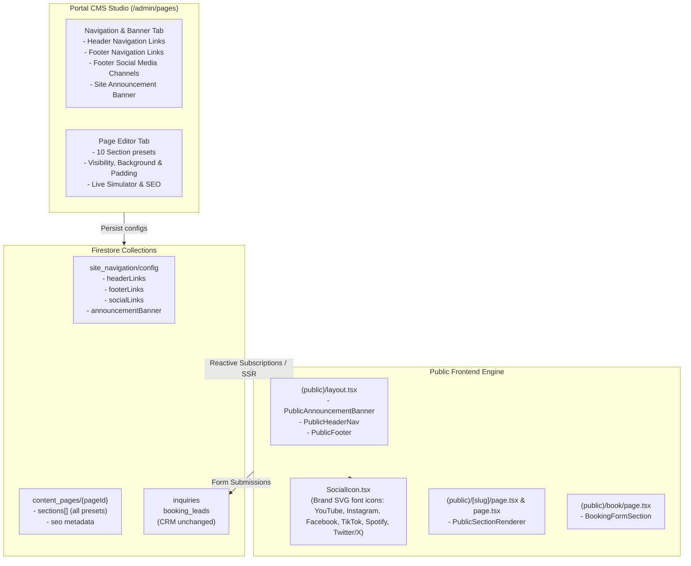

# Stage 29 Walkthrough: Public Website Modular Section Engine, Configurable Navigation & Social Media Integration

**Stage Number:** 29  
**Branch:** `feature/stage-29`  
**Status:** Completed / Verified

---

## 1. System Architecture Overview



---

## 2. Key Accomplishments

### A. Schemas & Type Invariance ([`src/lib/schema/siteConfig.ts`](file:///c:/repos/eagleburgerband/src/lib/schema/siteConfig.ts) & [`src/lib/schema/page.ts`](file:///c:/repos/eagleburgerband/src/lib/schema/page.ts))
1. **`SiteNavigationSchema` & `SocialLinkSchema`**:
   - Manages top-level navigation configuration under `site_navigation/config`.
   - `NavLinkSchema`: defines `id`, `label`, `href`, `isVisible`, `order`, `icon`, `isButton`, `isExternal`, `openInNewTab`.
   - `SocialLinkSchema`: defines `id`, `platform: "youtube" | "instagram" | "facebook" | "tiktok" | "spotify" | "twitter" | "custom"`, `label`, `href`, `isVisible`, `order`.
   - `AnnouncementBannerSchema`: defines `enabled`, `message`, `linkText`, `linkHref`, and `bannerType: "highlight" | "info" | "alert"`.
   - Seeded with safe fallbacks (`DEFAULT_HEADER_LINKS`, `DEFAULT_FOOTER_LINKS`, `DEFAULT_SOCIAL_LINKS`).
2. **`ContentSectionSchema` & Extended Presets**:
   - Added section layout and visibility controls:
     - `isVisible: z.boolean().default(true)`
     - `background: z.enum(["default", "surface", "gradient", "muted"]).default("default")`
     - `padding: z.enum(["compact", "standard", "generous"]).default("standard")`
   - Expanded `SectionTypeEnum` to include 10 total section presets:
     - `hero`, `rich_text`, `media_highlight`, `features`, `gig_feed_preview`
     - `booking_form`, `testimonials`, `faq`, `cta_banner`, `stats_counter`
   - Implemented Zod schemas for all new section presets with default content.

---

### B. Social Media Font Icons & Footer Navigation Integration
1. **`SocialIcon.tsx` ([`src/components/ui/SocialIcon.tsx`](file:///c:/repos/eagleburgerband/src/components/ui/SocialIcon.tsx))**:
   - Standalone, accessible SVG font-icon component for official brand glyphs:
     - **YouTube**: Official play rectangle with central triangle
     - **Instagram**: Rounded camera glyph
     - **Facebook**: Brand "f" glyph
     - **TikTok**: Musical note glyph
     - **Spotify**: Circular sound wave glyph
     - **Twitter / X**: Official X glyph
     - **Custom**: Globe fallback
   - Includes `getSocialBrandColors` helper providing platform-specific hover states and border highlights.
2. **Footer Navigation ([`src/components/public/PublicFooter.tsx`](file:///c:/repos/eagleburgerband/src/components/public/PublicFooter.tsx))**:
   - Reactively subscribes to `siteNav.socialLinks` from `site_navigation/config`.
   - Renders interactive social channel badges in the bio column under **"Follow & Stream"** with accessible titles and brand hover states.
   - All links include `suppressHydrationWarning`, `target="_blank"`, and `rel="noopener noreferrer"`.

---

### C. Upgraded CMS Navigation Studio ([`src/app/(portal)/admin/pages/page.tsx`](file:///c:/repos/eagleburgerband/src/app/(portal)/admin/pages/page.tsx))
1. **Footer Social Media Channels Manager**:
   - Dedicated management card in the "Navigation & Banner" tab.
   - Live icon preview for each configured channel.
   - Platform selector dropdown with automatic title synchronization.
   - Quick-add buttons for instant setup of YouTube, Instagram, or custom channels.
   - Reordering (Move Up / Move Down), visibility toggle (`Visible` / `Hidden`), and deletion.
2. **Header & Footer Link Management**:
   - Full reordering, link visibility toggles, and quick-add from published CMS pages.
3. **Global Site Announcement Banner**:
   - Configurable styles (`Highlight / Gold`, `Info / Sky Blue`, `Alert / Rose`), link action text, and live banner preview.

---

### D. Modular Public Section Engine ([`src/components/cms/PublicSectionRenderer.tsx`](file:///c:/repos/eagleburgerband/src/components/cms/PublicSectionRenderer.tsx))
- Universal renderer supporting all 10 section types with dynamic styling:
  - **Visibility Filter**: skips sections where `isVisible === false`.
  - **Background Presets**: applies `bg-slate-950`, `bg-slate-900/60`, `bg-gradient-to-b from-slate-900 to-slate-950`, or `bg-slate-900/40`.
  - **Padding Presets**: dynamically switches between compact (`py-8 sm:py-12`), standard (`py-14 sm:py-20`), or generous (`py-20 sm:py-32`) spacing.

---

### E. Booking Form Preset Component ([`src/components/public/BookingFormSection.tsx`](file:///c:/repos/eagleburgerband/src/components/public/BookingFormSection.tsx))
- Preserves **bot honeypot** (`company_website_url`).
- Preserves **submission timing validation** (rejects bot submissions under 2.5 seconds).
- Preserves **client session cooldown** (30-second throttle preventing form spamming).
- Preserves dual atomic writes to Firestore collections: `inquiries` and `booking_leads`, ensuring zero interruption to `/admin/inquiries`, `/admin/crm`, and dispatch workflows.

---

## 3. Verification & Build Results

1. **TypeScript Typecheck**:
   ```bash
   npx tsc --noEmit
   # Output: Exited with code 0 (clean, zero errors)
   ```
2. **ESLint**:
   ```bash
   npm run lint
   # Output: Exited with code 0 (clean, zero errors, zero warnings)
   ```
3. **Next.js Production Build**:
   ```bash
   npm run build
   # Output: Compiled successfully in 3.9s
   # Generating static pages (49/49)
   # Exited with code 0 (clean)
   ```

